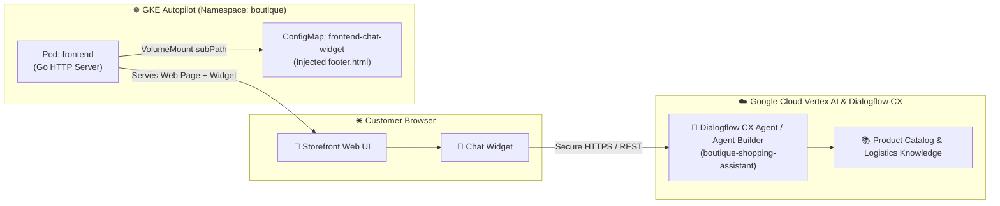

# 🤖 Vertex AI Agent Builder & Dialogflow CX Chatbot Integration

This module integrates an intelligent conversational shopping assistant directly into the **Google Online Boutique** storefront, backed by **Google Cloud Vertex AI Agent Builder** and **Dialogflow CX**.

---

## 🏛️ Architecture Overview



---

## 🔧 1. Infrastructure Layer (Terraform)

Located in [`terraform/chatbot.tf`](file:///home/joanr/agentic-platforms/GCP/K8SLab1/terraform/chatbot.tf):

1. **Required Google Cloud APIs:**
   - `dialogflow.googleapis.com` (Dialogflow CX Conversational Platform)
   - `discoveryengine.googleapis.com` (Vertex AI Agent Builder / Generative App Builder)
   - `aiplatform.googleapis.com` (Vertex AI Foundation Models)

2. **Conversational Agent Resource:**
   - Provisioned via `google_dialogflow_cx_agent.boutique_agent`.
   - Regional / Global deployment with English (`en`) and Spanish (`es`) language support.
   - Pre-configured Cloud Logging (`advanced_settings.logging_settings`) and speech adaptation.

3. **Terraform Outputs:**
   ```bash
   terraform output chatbot_agent_id
   terraform output chatbot_web_snippet
   ```

---

## 📦 2. Application & Manifest Layer (Kubernetes)

### Seamless Template Injection via Kustomize

Because the Online Boutique Go frontend renders templates dynamically at runtime (`templates/*.html`), we inject the chat widget into the web page **without modifying or rebuilding container images**:

1. **ConfigMap ([`01-chatbot-configmap.yaml`](file:///home/joanr/agentic-platforms/GCP/K8SLab1/kubernetes/manifests/04-chatbot/01-chatbot-configmap.yaml)):**
   Provides a tailored `footer.html` Go template including the Google Cloud Dialogflow Messenger (`<df-messenger>`) web component and custom floating styles.

2. **Deployment Patch ([`02-frontend-chatbot-patch.yaml`](file:///home/joanr/agentic-platforms/GCP/K8SLab1/kubernetes/manifests/04-chatbot/02-frontend-chatbot-patch.yaml)):**
   Applies a volume mount using `subPath: footer.html` to target `/src/templates/footer.html`, injecting the chat widget into every storefront page.

3. **Environment Variables:**
   - `CHATBOT_ENABLED`: `"true"`
   - `CHATBOT_PROVIDER`: `"vertex-ai-agent-builder"`
   - `DIALOGFLOW_PROJECT_ID`: `"bitcitychamp-project"`
   - `DIALOGFLOW_AGENT_ID`: `"boutique-shopping-assistant"`
   - `DIALOGFLOW_LOCATION`: `"global"`

---

## 🚀 3. Deployment & Testing Runbook

### Apply the Chatbot Layer
```bash
# 1. Apply manifests via Kustomize
kubectl apply -k kubernetes/manifests/

# 2. Restart frontend deployment to pick up the new template mount
kubectl rollout restart deployment/frontend -n boutique

# 3. Verify rollout completion
kubectl rollout status deployment/frontend -n boutique
```

### Verify in Browser
1. Open the storefront external IP in your browser:
   ```bash
   kubectl get svc frontend-external -n boutique
   ```
2. Locate the floating **AI Assistant** chat bubble at the bottom-right corner.
3. Click to open and interact with the conversational assistant!
