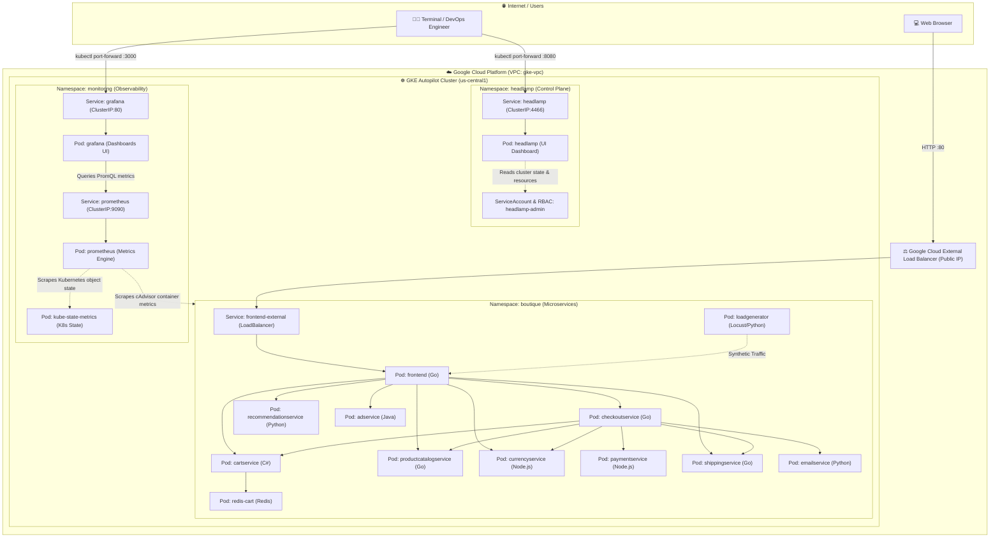

# 🏛️ Layer 2: Workloads, Control Plane & Observability (Cloud Native & Kubernetes)

Welcome to **Layer 2 of the Kubernetes Lab on Google Cloud Platform (GCP)**. Structured with production-grade engineering practices and an educational hands-on focus, this guide walks you through deploying, observing, interacting with, and troubleshooting workloads on a **GKE Autopilot** cluster.

---

## 📐 1. System Architecture

The deployment is organized into three decoupled, secure domains via Namespaces:
1. **`boutique` (Application Layer):** The complete polyglot microservices suite from **Google Cloud Online Boutique**, demonstrating synchronous gRPC/HTTP communication, Redis in-memory caching, and L4 external load balancing via Google Cloud Load Balancing.
2. **`headlamp` (Control Plane & Cluster Operations):** A modern, reactive, lightweight web dashboard developed under the **Kubernetes SIGs UI** project, configured with scoped RBAC for real-time cluster inspection.
3. **`monitoring` (Observability & Metrics Layer):** Enterprise monitoring stack combining **Prometheus**, **kube-state-metrics**, and **Grafana** with an auto-provisioned, production-ready **Online Boutique Microservices Dashboard** measuring per-microservice CPU, memory, network, and replica status.



---

## 🗂️ 2. Manifest Directory Structure

```text
kubernetes/manifests/
├── 00-namespaces/
│   └── namespace.yaml                  # Defines 'boutique', 'headlamp', and 'monitoring' namespaces
├── 01-boutique/
│   ├── 01-emailservice.yaml            # Email notifications (Python)
│   ├── 02-checkoutservice.yaml         # Checkout flow orchestrator (Go)
│   ├── 03-recommendationservice.yaml   # Product recommendation engine (Python)
│   ├── 04-frontend.yaml                # Web UI + External LoadBalancer service (Go)
│   ├── 05-paymentservice.yaml          # Payment and credit card processing (Node.js)
│   ├── 06-productcatalogservice.yaml   # Product search & catalog (Go)
│   ├── 07-cartservice.yaml             # Shopping cart state management (C# .NET)
│   ├── 08-currencyservice.yaml         # International currency conversions (Node.js)
│   ├── 09-shippingservice.yaml         # Shipping cost calculation and tracking (Go)
│   ├── 10-adservice.yaml               # Targeted contextual ads (Java)
│   ├── 11-redis-cart.yaml              # In-memory key-value cache for carts (Redis)
│   ├── 12-loadgenerator.yaml          # Background synthetic traffic generator (Locust)
│   └── release-complete.yaml           # Consolidated manifest for all 12 microservices
├── 02-dashboard/
│   └── 01-headlamp.yaml                # Headlamp UI, ServiceAccount, RBAC, and Secret token
├── 03-monitoring/
│   ├── 01-prometheus.yaml              # Prometheus Server, RBAC, cAdvisor scraping ConfigMap & Service
│   ├── 02-kube-state-metrics.yaml      # kube-state-metrics deployment, RBAC & Service
│   └── 03-grafana.yaml                 # Grafana UI, Datasource & Pre-loaded Boutique Dashboards
├── kustomization.yaml                  # Kustomize declaration for unified atomic deployment
└── README.md                           # This technical and interactive guide
```

---

## 🚀 3. Step-by-Step Deployment Guide

### Prerequisite: Connect `kubectl` to your GKE Cluster
Ensure your local CLI is authenticated against the cluster provisioned by Terraform:

```bash
gcloud container clusters get-credentials gke-autopilot-lab \
    --region us-central1 \
    --project bitcitychamp-project
```

Verify connectivity:
```bash
kubectl cluster-info
```

---

### Option A: Atomic Deployment via Kustomize (Recommended)
Apply the complete architecture (Namespaces, Microservices, Control Plane, and Observability) with a single command:

```bash
kubectl apply -k kubernetes/manifests
```

---

### Option B: Modular Step-by-Step Deployment (Didactic)

#### Step 1: Create the Namespaces
```bash
kubectl apply -f kubernetes/manifests/00-namespaces/namespace.yaml
```
Verify creation:
```bash
kubectl get namespaces -L app.kubernetes.io/part-of
```

#### Step 2: Deploy the Microservices Storefront
```bash
kubectl apply -f kubernetes/manifests/01-boutique/release-complete.yaml
```
Monitor pod provisioning (GKE Autopilot dynamically scales worker nodes to fit workloads):
```bash
kubectl get pods -n boutique -w
```
*(Wait until all pods reach the `Running` 1/1 state).*

#### Step 3: Deploy the Visual Control Plane (Headlamp)
```bash
kubectl apply -f kubernetes/manifests/02-dashboard/01-headlamp.yaml
```
Verify the dashboard rollout:
```bash
kubectl rollout status deployment/headlamp -n headlamp
```

#### Step 4: Deploy the Observability Stack (Prometheus & Grafana)
```bash
kubectl apply -f kubernetes/manifests/03-monitoring/01-prometheus.yaml
kubectl apply -f kubernetes/manifests/03-monitoring/02-kube-state-metrics.yaml
kubectl apply -f kubernetes/manifests/03-monitoring/03-grafana.yaml
```
Verify the monitoring rollout:
```bash
kubectl rollout status deployment/prometheus -n monitoring
kubectl rollout status deployment/grafana -n monitoring
```

---

## 🌐 4. Accessing the Microservices Storefront (Online Boutique)

The `frontend-external` service is configured with `type: LoadBalancer`. Google Cloud automatically provisions an external network load balancer and assigns a public IP address.

### 1. Retrieve the Public IP
```bash
kubectl get svc frontend-external -n boutique
```

Expected output:
```text
NAME                TYPE           CLUSTER-IP     EXTERNAL-IP      PORT(S)        AGE
frontend-external   LoadBalancer   10.30.12.84    34.123.45.67     80:31234/TCP   2m
```

> [!NOTE]
> If `EXTERNAL-IP` displays `<pending>`, GCP is still binding the forwarding rule and health checks. Wait 30 to 60 seconds and run `kubectl get svc frontend-external -n boutique -w`.

### 2. Explore the Storefront
Open in your browser:
```text
http://<EXTERNAL-IP>
```
You can browse products, add items to your cart, switch currencies (USD, EUR, JPY), and place orders.

---

## 📊 5. Accessing the Visual Control Plane (Headlamp UI)

Following cloud-native security best practices, the dashboard is exposed via `ClusterIP` and accessed through a secure, local encrypted tunnel (`kubectl port-forward`).

### 1. Start the Local Port-Forward
```bash
kubectl port-forward -n headlamp svc/headlamp 8080:80
```

### 2. Generate the RBAC Authentication Token
```bash
kubectl create token headlamp-admin -n headlamp --duration=48h
```

### 3. Log into Headlamp
1. Navigate to: **[http://localhost:8080](http://localhost:8080)**
2. Select the **Token** authentication option.
3. Paste the token from step 2 and click **Sign In**.

---

## 📈 6. Accessing the Observability Stack (Grafana & Prometheus)

### 1. Access Grafana Dashboards
Expose the Grafana service locally:
```bash
kubectl port-forward -n monitoring svc/grafana 3000:80
```
- Open **[http://localhost:3000](http://localhost:3000)** in your browser.
- **Authentication:** Anonymous Admin is enabled by default for frictionless local access. If prompted, login with `admin` / `admin`.
- **Pre-loaded Dashboard:** Navigate to **Dashboards > Online Boutique - Microservices Telemetry & Performance** to view the production-grade SRE telemetry suite.

---

### 2. Production Metrics Architecture (SRE Golden Signals & RED/USE Methods)

The Grafana dashboard incorporates a complete enterprise observability matrix based on **Google SRE 4 Golden Signals**, the **RED Method** (Rate, Errors, Duration), and the **USE Method** (Utilization, Saturation, Errors):

| Metric / Signal | Method / Standard | PromQL Expression | Purpose in Production |
| :--- | :--- | :--- | :--- |
| **1. Global Request Rate (Throughput)** | **RED:** Rate<br>**SRE:** Traffic | `sum(rate(http_requests_total[2m]))` | Measures instantaneous request demand in requests per second (RPS). Essential for detecting traffic spikes or anomalous drops in load. |
| **2. HTTP Error Rate by Status Code** | **RED:** Errors<br>**SRE:** Errors | `sum by (code) (rate(http_requests_total{code=~"[45].."}[2m]))` | Disaggregates errors by exact HTTP status code. Differentiates client errors (`4xx`: bad requests, auth) from critical backend outages (`5xx`: timeouts, crashes). |
| **3. Resource Saturation (Memory & CPU)** | **USE:** Saturation<br>**SRE:** Saturation | `100 * (container_memory / kube_pod_container_resource_limits)`<br>`100 * (cfs_throttled_periods / cfs_periods)` | Quantifies resource pressure before outages occur. At 100% memory, the kernel triggers **OOM-Killer**. When CPU quota is exhausted, **CFS throttling** inflates tail latency. |
| **4. Latency: Mean vs Percentiles (p50, p95, p99)** | **RED:** Duration<br>**SRE:** Latency | **Mean:** `rate(duration_sum) / rate(duration_count)`<br>**p50/p95/p99:** `histogram_quantile(0.95, ...)` | **SRE Standard:** The arithmetic mean alone hides spikes ("flaw of averages"). P95 and P99 percentiles expose tail latency experienced by the worst 5% and 1% of users. |
| **5. Service Availability (SLI / SLO %)** | **SRE Reliability:**<br>Three Nines (99.9%) | `clamp_max((1 - (rate(5xx_requests) / rate(total_requests))) * 100, 100)` | Service Level Indicator (SLI) evaluating compliance with the reliability target (SLO $\ge 99.9\%$) and error budget consumption. |

---

### 3. (Optional) Access Prometheus Direct Query UI
Expose Prometheus locally for ad-hoc PromQL queries:
```bash
kubectl port-forward -n monitoring svc/prometheus 9090:9090
```
- Open **[http://localhost:9090](http://localhost:9090)** in your browser.
- Test queries:
  - `sum(rate(http_requests_total[2m]))`
  - `sum by (code) (rate(http_requests_total[2m]))`
  - `100 * (sum by (pod) (container_memory_working_set_bytes{namespace="boutique", container!=""}) / sum by (pod) (kube_pod_container_resource_limits{namespace="boutique", resource="memory"}))`
  - `histogram_quantile(0.95, sum by (le) (rate(http_request_duration_seconds_bucket[2m])))`

---

## 🔬 7. Hands-On Observability & Diagnostics Labs

### Lab A: Self-Healing Pods
1. In Headlamp, open **Workloads > Pods** filtered by the `boutique` namespace.
2. In your terminal, delete the frontend or product catalog pod:
   ```bash
   kubectl delete pod -l app=productcatalogservice -n boutique
   ```
3. Watch Headlamp: the **ReplicaSet** instantly reconciles the observed state against the desired state, spinning up a healthy replacement pod in seconds with zero downtime.

### Lab B: Synthetic Traffic Injection & Throughput Monitoring
The `loadgenerator` microservice uses Locust to simulate concurrent user traffic browsing products, managing carts, and checking out.
1. Stream the live traffic generator logs:
   ```bash
   kubectl logs -n boutique -l app=loadgenerator -c main -f
   ```
2. In Grafana, inspect the **Global Request Rate (Throughput)** and **HTTP Request Rate by Response Code (RPS)** panels to observe live incoming traffic.

### Lab C: Live Log Inspection & Interactive Container Terminal
1. In Headlamp, click on the `redis-cart` pod.
2. Click **Logs** in the top navigation bar to view real-time cache reads and writes.
3. Click **Terminal** to open an interactive shell inside the container and test with `redis-cli ping` (you will receive `PONG`).

### Lab D: Microservices Telemetry & Performance Correlation (Grafana)
1. Open the Grafana dashboard at **[http://localhost:3000](http://localhost:3000)**.
2. Compare the **CPU Usage per Microservice (Cores)** chart with the **Memory Working Set per Microservice** chart:
   - Notice how `frontend` and `cartservice` show higher CPU activity due to `loadgenerator` traffic.
   - Notice how `redis-cart` maintains stable in-memory state.
3. In your terminal, scale the `loadgenerator` replicas to increase or decrease load:
   ```bash
   kubectl scale deployment/loadgenerator -n boutique --replicas=3
   ```
4. Observe the immediate spike in network throughput, CPU rate, and latency percentiles (p95, p99) directly in the Grafana graphs.

### Lab E: Resource Saturation & CPU Throttling Under Pressure (USE Method)
1. In Grafana, scroll to **CPU Saturation & CFS Throttling per Microservice** and **Memory Saturation per Microservice (% of Limit)**.
2. When workloads experience traffic spikes from `loadgenerator`, examine if `frontend` or `cartservice` pods approach the 80% warning threshold or if CFS throttling is triggered.
3. Correlate CPU Throttling periods with increases in **HTTP Request Latency: Mean vs Percentiles**, demonstrating why CPU starvation inflates tail response times.

---

## 🧹 8. Cleaning Up Layer 2 Resources

When testing is complete and you want to tear down the workloads without destroying the underlying Terraform infrastructure:

```bash
# Delete all resources managed via Kustomize
kubectl delete -k kubernetes/manifests

# Or delete the namespaces directly for a clean cascading teardown
kubectl delete namespace boutique headlamp monitoring
```


