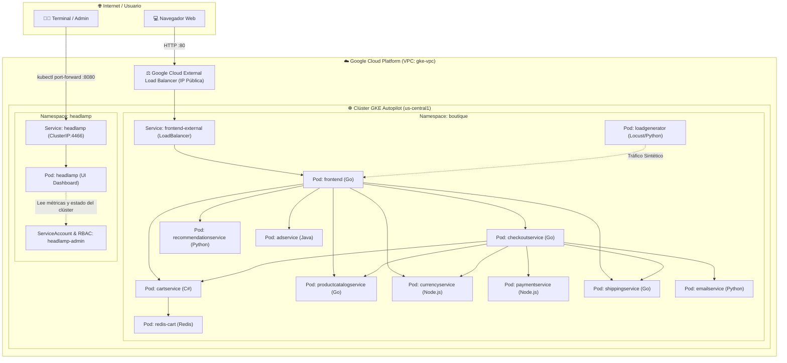

# 🏛️ Capa 2: Aplicación y Control Plane Didáctico (Cloud Native & Kubernetes)

Bienvenido a la **Capa 2 del Laboratorio de Kubernetes en Google Cloud Platform (GCP)**. Como Arquitecto de Cloud Native e Instructor Senior de Kubernetes, esta guía está estructurada con rigor de nivel de producción y un enfoque 100% pedagógico para observar, interactuar y diagnosticar cargas de trabajo en un clúster **GKE Autopilot**.

---

## 📐 1. Arquitectura del Sistema

El despliegue se divide en dos dominios aislados por Namespaces:
1. **`boutique` (Capa de Aplicación):** La suite completa de microservicios políglotas de **Google Cloud Online Boutique**, diseñada para demostrar comunicación síncrona gRPC/HTTP, persistencia en caché con Redis y balanceo de carga L4 con Google Cloud Load Balancing.
2. **`headlamp` (Capa de Observabilidad y Control):** Interfaz gráfica moderna, reactiva y ligera desarrollada bajo el proyecto **Kubernetes SIGs UI**, configurada con RBAC de privilegios controlados para inspección en tiempo real.



---

## 🗂️ 2. Estructura de Manifiestos

```text
kubernetes/manifests/
├── 00-namespaces/
│   └── namespace.yaml                  # Define los namespaces 'boutique' y 'headlamp'
├── 01-boutique/
│   ├── 01-emailservice.yaml            # Notificaciones por correo (Python)
│   ├── 02-checkoutservice.yaml         # Orquestador del flujo de compra (Go)
│   ├── 03-recommendationservice.yaml   # Motor de recomendaciones de productos (Python)
│   ├── 04-frontend.yaml                # UI Web + Service LoadBalancer externo (Go)
│   ├── 05-paymentservice.yaml          # Procesamiento de tarjetas y pagos (Node.js)
│   ├── 06-productcatalogservice.yaml   # Búsqueda y catálogo de productos (Go)
│   ├── 07-cartservice.yaml             # Gestión de carritos de compra (C# .NET)
│   ├── 08-currencyservice.yaml         # Conversión de divisas internacionales (Node.js)
│   ├── 09-shippingservice.yaml         # Cálculo de costes y tracking de envíos (Go)
│   ├── 10-adservice.yaml               # Anuncios contextuales orientados (Java)
│   ├── 11-redis-cart.yaml              # Persistencia en memoria para carritos (Redis)
│   ├── 12-loadgenerator.yaml          # Generador de tráfico sintético en segundo plano
│   └── release-complete.yaml           # Manifiesto consolidado de los 12 microservicios
├── 02-dashboard/
│   └── 01-headlamp.yaml                # Headlamp UI, ServiceAccount, RBAC y Secret Token
├── kustomization.yaml                  # Declaración Kustomize para despliegue atómico
└── README.md                           # Esta guía técnica e interactiva
```

---

## 🚀 3. Guía de Despliegue Paso a Paso

### Prerrequisito: Conectar `kubectl` a tu clúster GKE
Asegúrate de que tu CLI esté enlazada al clúster aprovisionado por Terraform:

```bash
gcloud container clusters get-credentials gke-autopilot-lab \
    --region us-central1 \
    --project bitcitychamp-project
```

Verifica la conexión:
```bash
kubectl cluster-info
```

---

### Opción A: Despliegue Atómico con Kustomize (Recomendado)
Aplica toda la arquitectura (Namespaces, Microservicios y Dashboard) en un único comando:

```bash
kubectl apply -k kubernetes/manifests
```

---

### Opción B: Despliegue Modular Paso a Paso (Didáctico)

#### Paso 1: Crear los Espacios de Nombres (Namespaces)
```bash
kubectl apply -f kubernetes/manifests/00-namespaces/namespace.yaml
```
Verifica su creación:
```bash
kubectl get namespaces -L app.kubernetes.io/part-of
```

#### Paso 2: Desplegar la Tienda de Microservicios
Puedes desplegar el archivo consolidado:
```bash
kubectl apply -f kubernetes/manifests/01-boutique/release-complete.yaml
```
*O aplicar cada microservicio individualmente desde `kubernetes/manifests/01-boutique/` si deseas explicar a tu equipo la función de cada pod.*

Supervisa el aprovisionamiento de los pods (en GKE Autopilot, el clúster escalará dinámicamente nuevos nodos para albergar las cargas):
```bash
kubectl get pods -n boutique -w
```
*(Espera a que todos los pods alcancen el estado `Running` 1/1).*

#### Paso 3: Desplegar el Panel de Control Visual (Headlamp)
```bash
kubectl apply -f kubernetes/manifests/02-dashboard/01-headlamp.yaml
```
Verifica que el pod del dashboard esté listo:
```bash
kubectl rollout status deployment/headlamp -n headlamp
```

---

## 🌐 4. Acceso a la Tienda de Microservicios (Online Boutique)

El servicio `frontend-external` está configurado con `type: LoadBalancer`. GCP aprovisionará automáticamente un balanceador de carga de red externo y le asignará una dirección IP pública.

### 1. Obtener la IP Pública
Ejecuta el siguiente comando:
```bash
kubectl get svc frontend-external -n boutique
```

Salida esperada:
```text
NAME                TYPE           CLUSTER-IP     EXTERNAL-IP      PORT(S)        AGE
frontend-external   LoadBalancer   10.30.12.84    34.123.45.67     80:31234/TCP   2m
```

> [!NOTE]
> Si en `EXTERNAL-IP` aparece `<pending>`, GCP aún está asociando la regla de reenvío del balanceador. Espera entre 30 y 60 segundos y vuelve a consultar con `kubectl get svc frontend-external -n boutique -w`.

### 2. Navegar en la Tienda
Abre en tu navegador web:
```text
http://<EXTERNAL-IP>
```
Podrás interactuar añadiendo productos al carrito, cambiando la divisa (USD, EUR, JPY) y completando un pedido.

---

## 📊 5. Acceso a la Interfaz de Control Gráfica (Headlamp UI)

Por seguridad y mejores prácticas de arquitectura en la nube, el dashboard se expone mediante `ClusterIP` y se accede de forma segura mediante túnel local cifrado (`kubectl port-forward`).

### 1. Iniciar el Port-Forward Local
Abre una terminal y ejecuta:
```bash
kubectl port-forward -n headlamp svc/headlamp 8080:80
```

### 2. Obtener el Token de Autenticación RBAC
En **GKE Autopilot** (Kubernetes con OIDC de Google Cloud activado), el API Server valida la firma OIDC y la audiencia (`aud`) del clúster. Por ello, genera el token dinámico con:

```bash
kubectl create token headlamp-admin -n headlamp --duration=48h
```

*(Copia la cadena generada y pégala en el campo Token del panel).*

### 3. Iniciar Sesión en Headlamp
1. Entra en tu navegador a: **[http://localhost:8080](http://localhost:8080)**
2. Selecciona la opción de autenticación mediante **Token**.
3. Pega el token obtenido en el paso anterior y haz clic en **Sign In**.

---

## 🔬 6. Laboratorios Didácticos de Observación en Vivo

Como instructor o evaluador del sistema, puedes realizar los siguientes experimentos prácticos para evidenciar las capacidades de Kubernetes y GKE Autopilot:

### Laboratorio A: Auto-recuperación (Self-Healing de Pods)
1. En Headlamp, abre la sección **Workloads > Pods** filtrando por el namespace `boutique`.
2. En tu terminal, elimina intencionalmente el pod del frontend o del catálogo de productos:
   ```bash
   kubectl delete pod -l app=productcatalogservice -n boutique
   ```
3. Observa en Headlamp cómo el **ReplicaSet** detecta inmediatamente la discrepancia con el estado deseado (`desired state`) y crea un pod sustituto en cuestión de segundos sin caída del servicio.

### Laboratorio B: Inyección y Análisis de Tráfico Sintético
El microservicio `loadgenerator` utiliza Locust para simular usuarios concurrentes navegando, añadiendo artículos y comprando.
1. Observa los logs en vivo del generador de tráfico:
   ```bash
   kubectl logs -n boutique -l app=loadgenerator -c main -f
   ```
2. En Headlamp, examina el consumo de CPU y memoria de `frontend` y `cartservice` conforme absorben las peticiones recurrentes.

### Laboratorio C: Inspección de Logs y Terminal Interactiva desde Headlamp
1. En Headlamp, haz clic sobre el pod `redis-cart`.
2. En la barra superior, presiona el botón **Logs** para ver las lecturas y escrituras en memoria en tiempo real.
3. Presiona el botón **Terminal** para abrir una shell interactiva dentro del contenedor y ejecutar `redis-cli ping` (recibirás `PONG`).

---

## 🧹 7. Limpieza de Recursos de la Capa 2

Cuando concluyas las pruebas y desees liberar los microservicios sin destruir la infraestructura base de Terraform:

```bash
# Elimina todos los recursos desplegados mediante Kustomize
kubectl delete -k kubernetes/manifests

# O elimina directamente los namespaces para purga total en cascada
kubectl delete namespace boutique headlamp
```
