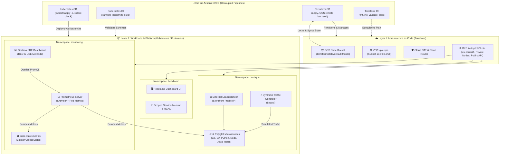
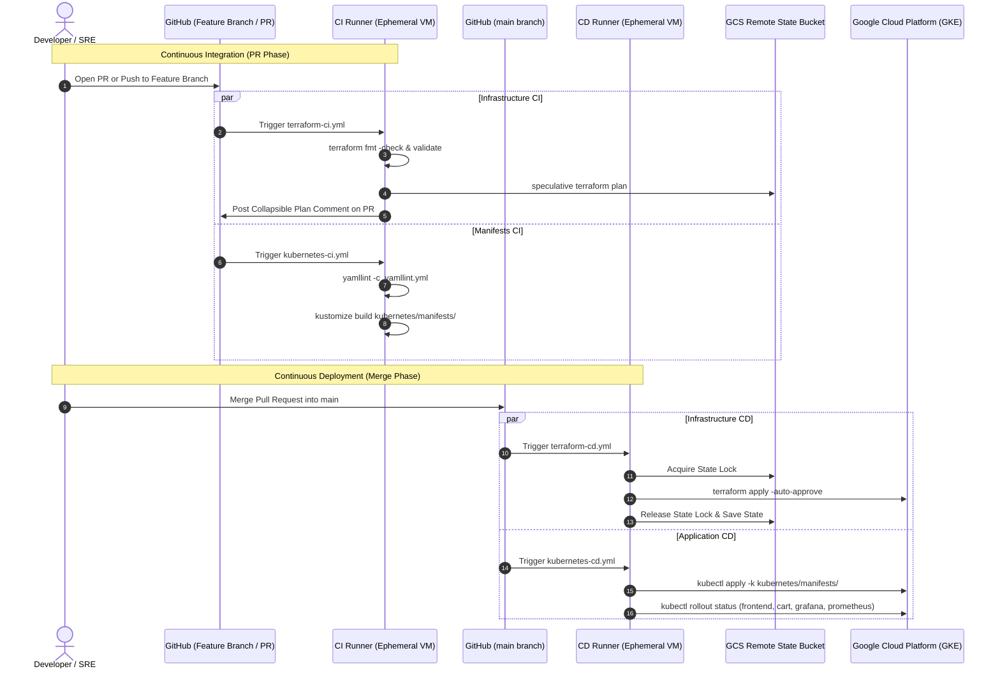

# ☁️ Enterprise Kubernetes Platform on Google Cloud (GKE Autopilot)

[](https://cloud.google.com/kubernetes-engine)
[](https://www.terraform.io/)
[](https://kubernetes.io/)
[](https://github.com/features/actions)
[](https://prometheus.io/)
[](https://grafana.com/)

An enterprise-grade, dual-layer cloud platform designed to provision, operate, and observe containerized microservices on **Google Kubernetes Engine (GKE Autopilot)**. Features fully decoupled **CI/CD GitHub Actions pipelines**, **Google Cloud Storage (GCS) remote state management**, an automated **Observability Suite** (Prometheus & Grafana) with **SRE Golden Signals (RED & USE methods)**, and **Headlamp UI** for cluster operations.

---

## 🏛️ Architecture Overview

The system is architected into two strictly decoupled layers to ensure clear separation of concerns, least privilege access, and independent release lifecycles:



---

## 🗂️ Project Repository Tree

```text
.
├── .github/
│   └── workflows/
│       ├── terraform-ci.yml    # [CI] Terraform fmt, validate, speculative plan & PR comment
│       ├── terraform-cd.yml    # [CD] Terraform apply with GCS remote state & lock-timeout
│       ├── kubernetes-ci.yml   # [CI] yamllint & kustomize build validation
│       └── kubernetes-cd.yml   # [CD] Automated deployment to GKE & workload rollout checks
├── .yamllint.yml               # Strict linter configuration for Kubernetes manifests
├── terraform/                  # [Layer 1] Infrastructure as Code
│   ├── main.tf                 # VPC, Subnet, Cloud Router, NAT, and GKE Autopilot Cluster
│   ├── monitoring.tf           # Workload integration hook & state stubs
│   ├── outputs.tf              # Endpoints, connection strings, and network attributes
│   ├── provider.tf             # GCS remote backend & Google Cloud provider config
│   ├── variables.tf            # Input variables and cluster customization defaults
│   └── terraform.tfvars.example# Parameter configuration template
└── kubernetes/                 # [Layer 2] Workloads, Control Plane & Observability
    └── manifests/
        ├── 00-namespaces/      # 'boutique', 'headlamp', and 'monitoring' namespaces
        ├── 01-boutique/        # Google Online Boutique 12 microservices suite
        ├── 02-dashboard/       # Headlamp UI Dashboard deployment & RBAC
        ├── 03-monitoring/      # Prometheus, kube-state-metrics & Grafana SRE Dashboard
        ├── kustomization.yaml  # Unified atomic deployment manifest
        └── README.md           # In-depth architectural guide and operational labs
```

---

## 🔄 Enterprise CI/CD Automation (GitHub Actions)

The repository provides **4 decoupled, single-purpose workflows**, completely separating infrastructure management from application deployments:



### Workflow Specifications

| Pipeline | Target Layer | Event Trigger | Core Steps / Gates | Expected Duration |
| :--- | :--- | :--- | :--- | :---: |
| **`terraform-ci.yml`** | Layer 1 (Infra) | Pull Request (`terraform/**`) | `fmt -check` ➔ `init` ➔ `validate` ➔ speculative `plan` ➔ PR sticky comment | ~45s |
| **`terraform-cd.yml`** | Layer 1 (Infra) | Push / Merge (`main`) | Authenticate GCP ➔ `init (gcs)` ➔ `apply -auto-approve -lock-timeout=60s` | ~1m 30s |
| **`kubernetes-ci.yml`** | Layer 2 (Apps) | Pull Request (`kubernetes/**`) | `yamllint` syntax validation ➔ `kustomize build` schema validation | ~25s |
| **`kubernetes-cd.yml`** | Layer 2 (Apps) | Push / Merge (`main`) | Authenticate GCP ➔ Bind GKE credentials ➔ `kubectl apply -k` ➔ Rollout verifications | ~40s |

### 🔐 Remote State & GitHub Secrets Configuration

1. **Remote Backend in Google Cloud Storage (GCS):**
   State locking and centralization prevent concurrency drift and the `409 Conflict: resource already exists` error in ephemeral CI/CD runners:
   ```hcl
   terraform {
     backend "gcs" {
       bucket = "8bitcitychamp-tfstate-bitcitychamp-project"
       prefix = "terraform/state"
     }
   }
   ```

2. **Required GitHub Repository Secrets:**
   Configure under **Repository Settings ➔ Secrets and variables ➔ Actions**:
   - `GCP_PROJECT_ID`: Google Cloud Project ID (e.g., `bitcitychamp-project`).
   - `GCP_SA_KEY`: Service Account JSON Key with Compute Admin, GKE Admin, and Storage Admin privileges.

---

## 📊 Observability Matrix & SRE Golden Signals (Grafana)

The pre-loaded Grafana dashboard (`Online Boutique - Microservices Telemetry & Performance`) provides **17 real-time telemetry panels** categorized by industry reliability engineering standards:

```text
+-----------------------------------------------------------------------------------------+
|                  ONLINE BOUTIQUE — SRE TELEMETRY & PERFORMANCE DASHBOARD                |
+-----------------------------------------------------------------------------------------+
|  [ 🟢 100% SLI/SLO Availability ]   [ 🛒 12 Active Pods ]   [ ⚡ 48.5 Total Req/s (RPS) ]|
+-----------------------------------------------------------------------------------------+
|  [ RED ] Global Request Rate (Throughput)    |  [ RED ] HTTP Request Rate by Code (RPS)  |
|  [ RED ] HTTP Error Rate (4xx vs 5xx)        |  [ RED ] Latency: Mean vs p50/p95/p99     |
+-----------------------------------------------------------------------------------------+
|  [ USE ] CPU Usage per Microservice (Cores)  |  [ USE ] CPU Saturation & CFS Throttling  |
|  [ USE ] Memory Working Set (RAM Bytes)      |  [ USE ] Memory Saturation (% of Limit)   |
|  [ USE ] Network Receive / Transmit (B/s)    |  [ USE ] Pod Lifecycle Restarts           |
+-----------------------------------------------------------------------------------------+
```

### Telemetry Signals Breakdown

| Category | Panel Title | Key PromQL Formula | Production Value & Thresholds |
| :--- | :--- | :--- | :--- |
| **SLO / SLI** | **Service Availability %** | `clamp_max((1 - (rate(5xx_requests)/rate(total_requests)))*100, 100)` | Tracks error budget consumption against the 99.9% Three Nines objective. |
| **RED: Rate** | **Global Request Rate (RPS)** | `sum(rate(http_requests_total[2m]))` | Measures instantaneous traffic demand across storefront microservices. |
| **RED: Errors** | **HTTP Error Rate by Code** | `sum by (code)(rate(http_requests_total{code=~"[45].."}[2m]))` | Disaggregates client errors (`4xx`) from fatal server crashes/timeouts (`5xx`). |
| **RED: Duration** | **Latency: Mean vs p50, p95, p99** | `histogram_quantile(0.95, sum by (le)(rate(duration_bucket[2m])))` | Overcomes the "flaw of averages" by exposing tail latency spikes. |
| **USE: Saturation**| **CPU CFS Throttling %** | `100 * (rate(throttled_periods[2m]) / rate(cfs_periods[2m]))` | Detects thread starvation caused by hard container CPU limits. |
| **USE: Saturation**| **Memory Saturation %** | `100 * (container_memory / resource_limits)` | Alert trigger at >80%; prevents Out-Of-Memory (OOM-Killed) pod terminations. |
| **USE: Errors** | **Container Restarts** | `sum by (pod)(changes(kube_pod_container_status_restarts_total[30m]))` | Immediate visibility into crash-looping workloads or intermittent panics. |

---

## ⚡ Step-by-Step Operator Runbook

### 1. Authenticate to Cluster
```bash
gcloud container clusters get-credentials gke-autopilot-lab \
    --region us-central1 \
    --project bitcitychamp-project
```

### 2. Manual Deployment via Kustomize (Local or Fallback)
```bash
kubectl apply -k kubernetes/manifests
```

### 3. Verify Storefront & External Load Balancer
```bash
kubectl get svc frontend-external -n boutique
```
Open in browser: `http://<EXTERNAL-IP>`

### 4. Access the Headlamp Visual Control Plane
```bash
# Terminal 1: Port-forward
kubectl port-forward -n headlamp svc/headlamp 8080:80

# Terminal 2: Generate bearer token
kubectl create token headlamp-admin -n headlamp --duration=48h
```
Navigate to: **[http://localhost:8080](http://localhost:8080)** and authenticate using the generated token.

### 5. Access the Grafana SRE Dashboard
```bash
kubectl port-forward -n monitoring svc/grafana 3000:80
```
Navigate to: **[http://localhost:3000](http://localhost:3000)** (Anonymous Admin enabled; credentials if prompted: `admin` / `admin123`).
Open: **Dashboards ➔ Online Boutique - Microservices Telemetry & Performance**.

### 6. Access Prometheus Query Console (Optional)
```bash
kubectl port-forward -n monitoring svc/prometheus 9090:9090
```
Navigate to: **[http://localhost:9090](http://localhost:9090)** for ad-hoc PromQL debugging.

---

## 🧹 Teardown & Clean Destruction

When tearing down the laboratory to incur zero lingering costs:

> [!CAUTION]
> Execute teardown in the exact order below. Tearing down the VPC before workloads can strand external IP reservations.

```bash
# 1. Clean up Kubernetes Workloads & Cloud Load Balancers
kubectl delete -k kubernetes/manifests

# 2. Destroy Underlying Cloud Infrastructure via Terraform
cd terraform
terraform destroy -auto-approve

# 3. (Optional) Remove the GCS Remote State Bucket
gcloud storage rm -r gs://8bitcitychamp-tfstate-bitcitychamp-project
```

---

## 🛡️ Production Best Practices Implemented

- **Ephemeral Runner Safety:** State is never persisted in local Git checkouts or runner disks; GCS state locking ensures consistent concurrency.
- **Speculative PR Plans:** Developers can review exact infrastructure diffs in GitHub Pull Request comments before merging.
- **Private GKE Nodes:** Cluster worker nodes run strictly with private IP addresses; internet egress is mediated by Cloud NAT.
- **Zero Local Footprint:** Zero third-party local libraries or packages required on the host workstation; all verification scripts run in standardized GitHub Actions containers.